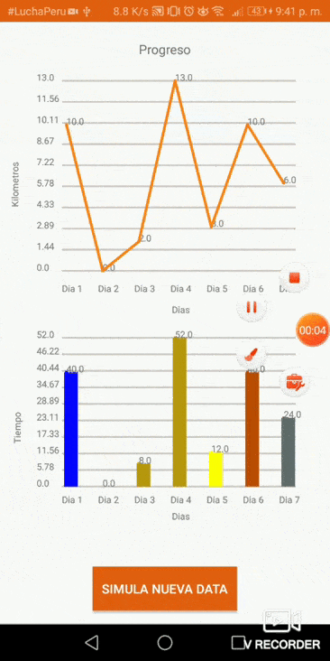

# Examen 02 - Pregunta 02

El aplicativo running permite mostrar estadísticas, entonces, implemente un componente grafico que permita visualizar información estadística de los últimos siete días (ver el grafico referencial). La información puede ser respecto a los kilómetros recorridos en un día, calorías quemadas en un día, u otra información relevante. No está permitido el uso de librerías de terceros. Se puede reutilizar código siempre y cuando se personalice y se haga referencia, caso contrario se considerara como plagio. 
 
  - Uso de Canvas

# Resultados

  - Diseño Final

       

**UNSA**

Integrantes

  - Edwin Saavedra
  - Luis Lorenzo Quilla
  - Erick Carpio
  - Braulio Chire