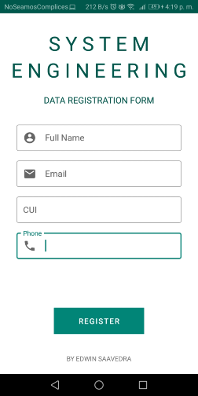
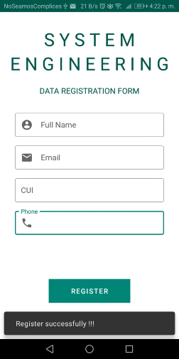
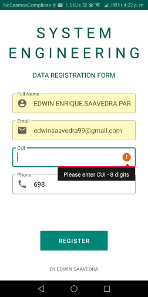

# Laboratorio 02

Autor: Edwin Enrique Saavedra Parisaca, CUI:20162753.

Tarea Asignada : Crear un formulario para registrar los principales datos de un estudiante de la escuela de Ingeniería de Sistemas. 

  - Creacion de primera Aplicacion
  - Diseño de Formulario
  - Explorando el uso de librerias

# Resultados

  - Diseño Final

    

  - Eventos Programados
  
    

  - Validación de Formulario

    
  

**UNSA**
