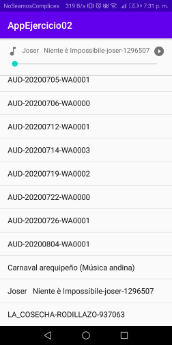

# Laboratorio 03 - Ejercicio 02

Trabajo Grupal

Tarea Asignada : Si tiene un aplicativo que reproduce un audio como música de fondo, el cual tiene el siguiente comportamiento: automáticamente reproduce el video cuando el aplicativo está en primer plano, y cuando el aplicativo no se encuentra en primer plano pausa el audio. 

  - Uso de MediaPlayer
  - Implementacion de función stopAudio()
  - Implementacion de función restartAudio()

# Resultados

  - Diseño Final

       

**UNSA**
