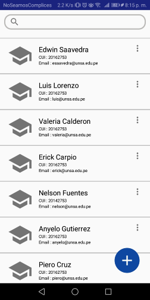
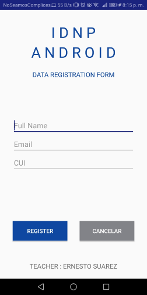

# Laboratorio 04

Trabajo Grupal

Tarea Asignada : Desarrollar un aplicativo que permite administrar los estudiantes de un curso. El aplicativo se compone de tres activities (Mas informacion en el reporte presentado). 

Se usa : comunicacion entre activitys, lista de datos e intents

# Resultados

  - Diseño Activity Principal

       

  - Diseño Activity Form

       

**UNSA**
